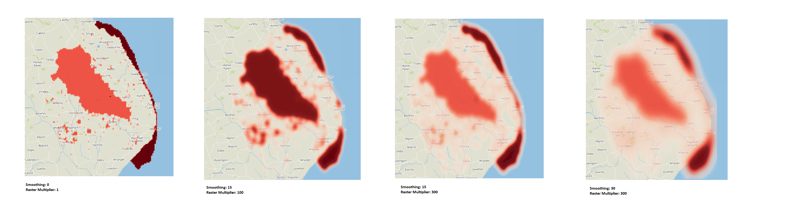

# Heat-Mapper
Creates a heat map from the following *required* folder structure:  

/data/AOI  
	*yourAreaOfInterest.shp*  
/data/Constraints/1  
	*contraintWithMagnitudeOfOne.shp*  
	*anotherContraintWithMagnitudeOfOne.shp*  
/data/Constraints/2  
	*contraintWithMagnitudeOfTwo.shp*  

Mess around with the variables:  
+ Raster Magnitude *The higher the number the greater intensity of contraint, think of this like contrast*
+ Smoothness *Applies a gaussian filter to smooth your heatmap, this is the sigma value*

